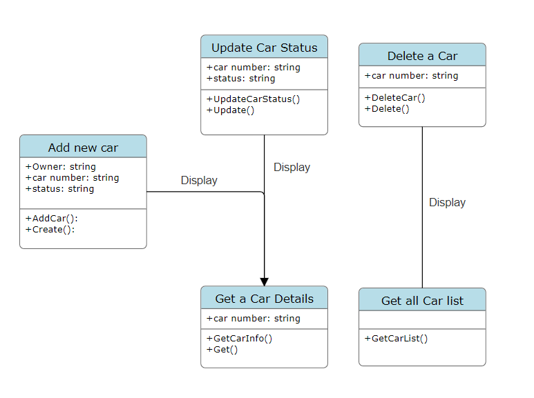

# GO CAR GARAGE MANAGEMENT

I have developed a mini-project using the GoFr framework to build a simple HTTP API for a Car Garage Management service. The API includes CRUD operations for managing entries of cars in the garage and integrates with a MySQL database using docker for persistent data storage. The key functionalities implemented include adding a new entry to the database when a car enters the garage (capturing owner name, car number, and status), retrieving the list of currently parked cars, fetching details of a specific car based on its number, updating the entry when a car undergoes repair with relevant status parameters, and finally, deleting the entry from the database when the car leaves the garage using its number. Furthermore, activity diagrams and UML diagrams are also created to provide a visual representation of the system's interactions and structure, understanding of the project architecture.

### UML CLASS DIAGRAM


### UML ACTIVITY DIAGRAM


### Commands to run the program

To download gofr, use the command: 
```
go get gofr.dev
```

To download and sync the required modules, use the command:
```
go mod tidy
```

run the mysql server and create a database locally using the following docker command:
```
docker run --name gofr-mysql -e MYSQL_ROOT_PASSWORD=root123 -e MYSQL_DATABASE=test_db -p 3306:3306 -d mysql:8.0.30
```

Access test_db database and create table car:
```
docker exec -it gofr-mysql mysql -uroot -proot123 test_db -e "CREATE TABLE car (id INT AUTO_INCREMENT PRIMARY KEY, Owner VARCHAR(255) NOT NULL, CarNo VARCHAR(255) NOT NULL, Status VARCHAR(255) NOT NULL);"
```

To run the server, use the command:
```
go run main.go
```

Note: Access the server at port 8080 which can be modified in .env file.
